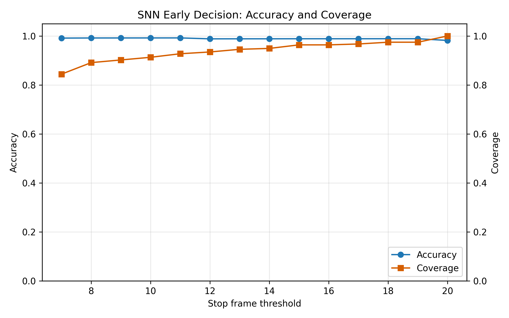
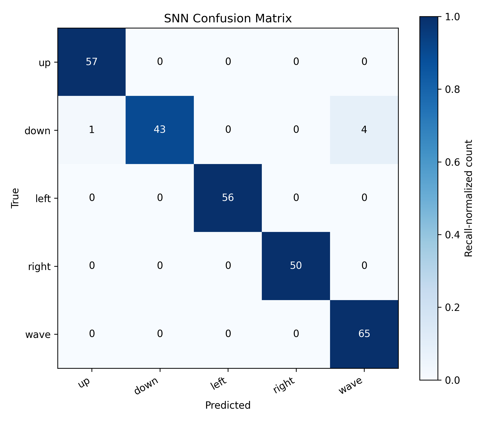

# SNN Early Decision for Gesture Recognition

This project explores early decision-making for hand gesture recognition using a Spiking Neural Network (SNN). Instead of waiting for a full gesture sequence, the model can predict from a prefix of the sequence once confidence and temporal stability thresholds are satisfied.

## Highlights

- Hand landmark sequence collection with camera-based tracking.
- Preprocessing pipeline for aligned gesture sequences.
- SNN classifier implemented with PyTorch and snnTorch.
- Early-exit inference based on confidence and stable consecutive predictions.
- Realtime webcam demo for five gesture classes: `up`, `down`, `left`, `right`, and `wave`.
- Analysis scripts for visualizing accuracy/latency trade-offs.

## Project Structure

```text
src/
  analysis/        Result visualization and early-decision trade-off analysis
  capture/         Hand landmark capture and dataset collection scripts
  infer/           Offline and realtime inference demos
  models/          SNN model definition
  preprocessing/   Sequence cleaning, alignment, and preprocessing
  train/           SNN and LSTM training scripts
  utils/           Logging utilities
```

Local datasets, trained weights, logs, and generated results are intentionally excluded from Git so the repository stays lightweight.

## Setup

```bash
python -m venv .venv
.venv\Scripts\activate
pip install -r requirements.txt
```

## Typical Workflow

1. Collect or prepare hand landmark sequences.
2. Preprocess raw data into NumPy arrays under `dataset/processed/`.
3. Train the SNN model:

```bash
python src/train/snn_train.py
```

4. Run realtime early-decision inference after a checkpoint is available:

```bash
python src/infer/snn_realtime_demo.py
```

The realtime demo expects a trained checkpoint at:

```text
weights/snn_model.pth
```

## Method

Each gesture is represented as a temporal sequence of 21 hand landmarks with 3D coordinates. The SNN processes the sequence frame by frame and accumulates logits over time. During inference, the system evaluates partial sequences and locks a prediction when both conditions are met:

- prediction confidence is above a threshold;
- the predicted class is stable for several consecutive frames.

This design targets lower decision latency while preserving classification reliability.

## Results

The project includes result visualizations for the SNN early-decision pipeline and the LSTM baseline. The owner-collected dataset was first validated with an LSTM baseline, then used to evaluate the SNN early-decision behavior.

### SNN Early-Decision Trade-off



### SNN Confusion Matrix



## Notes

- Trained checkpoints and datasets are not included in this repository.
- For fully reproducible public results, add a small sample dataset, evaluation script, and a table of measured accuracy/latency metrics.
